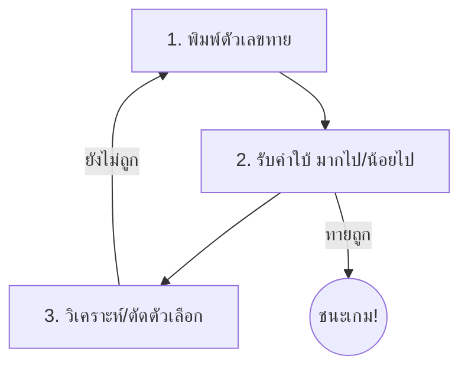
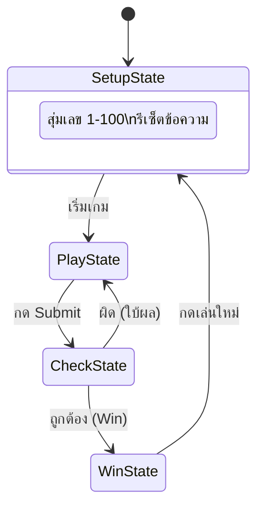
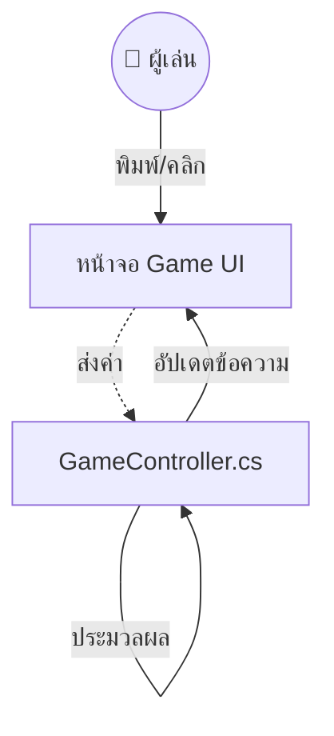

# High-Low Game Diagrams

## 1. Core Loop

```mermaid
graph TD
    Action[1. พิมพ์ตัวเลขทาย] --> Feedback[2. รับคำใบ้ มากไป/น้อยไป]
    Feedback --> Analyze[3. วิเคราะห์/ตัดตัวเลือก]
    Analyze -->|ยังไม่ถูก| Action
    Feedback -->|ทายถูก| Win((ชนะเกม!))
```

## 2. State Machine

```mermaid
stateDiagram-v2
    [*] --> SetupState
    state SetupState {
        note: สุ่มเลข 1-100\nรีเซ็ตข้อความ
    }
    SetupState --> PlayState : เริ่มเกม
    PlayState --> CheckState : กด Submit
    CheckState --> PlayState : ผิด (ใบ้ผล)
    CheckState --> WinState : ถูกต้อง (Win)
    WinState --> SetupState : กดเล่นใหม่
```

## 3. Architecture

```mermaid
graph TD
    Player((👤 ผู้เล่น)) -->|พิมพ์/คลิก| UI[หน้าจอ Game UI]
    UI -.->|ส่งค่า| Controller[GameController.cs]
    Controller -->|ประมวลผล| Controller
    Controller -->|อัปเดตข้อความ| UI
```
